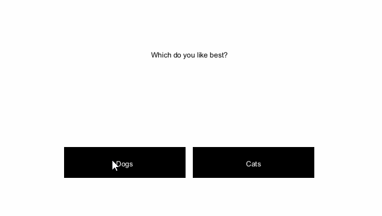

# Kiosk

Discovery World's Career Pathways Kiosk developed by an MSOE Senior Design team.

# Setup

## Project

* Clone the repo `git clone git@gitlab.com:msoe.edu/sdl/sd21/discoveryworld/kiosk.git`
* In Intellij: `File > New > Project from Existing Sources`
* Navigate to the `kiosk` folder and select it
* Follow Intellij's defaults for importing the project
* Visit *Troubleshooting* if you had issues

## Checkstyle linter

* Install the Checkstyle plugin `File > Settings > Plugins > Marketplace`
* Search for and install the Checkstyle plugin
* Restart IntelliJ
* Add the team's checkstyle rules `File > Settings > Tools > Checkstyle > Configuration File > '+'`
* Add a description and the local file `checkstyle.xml`
* Press OK
* Select the new checkstyle's checkbox
* Apply changes

# Build

* From the project directory run `mvn package`
* These files will appear in the `target` directory
  * kiosk.java
  * editor.java
* Note: The kiosk and editor require specific assets, so before running the project run the following command 
  \`cp -r assets target`. This will copy all the required assets into the target directory.

## IntelliJ Project Setup

- Go to:
  - `File > Project Structure`
- Under Project:
  - `Project SDK: > Edit > "+" > Download JDK... > Amazon Corretto 1.8 > Download`
- Go back to Project:
  - `Project SDK: > Select corretto-1.8 from the drop down`
  - `Project language level > "8 - Lambdas, type annotations etc."`
- Go to Modules
  - `Module SDK: > Select Project SDK corretto-1.8`
- Go to Libraries
  - Remove JavaFX libraries (if you have them). They are included in the SDK
- Reload Maven by right clicking on a source file
  - `Right click on a source file > Run Maven > Reimport`

## Running

Run the Jar using `java -jar target/kiosk.jar`.

# Troubleshooting

## Ensure the `src` directory is marked as the source root 

In the Project Explorer, right click the `src` directory.

`Mark Directory As > Sources Root`

## Missing dependencies

* `File > Project Structure > Libraries > '+' > New Project Library 'Java'`

* Navigate to the project's directory and shift add all the jar files in `lib`.

* Press OK and add apply changes before exiting.

## Still not working?

Ask the team and then post what you did to fix it here.
